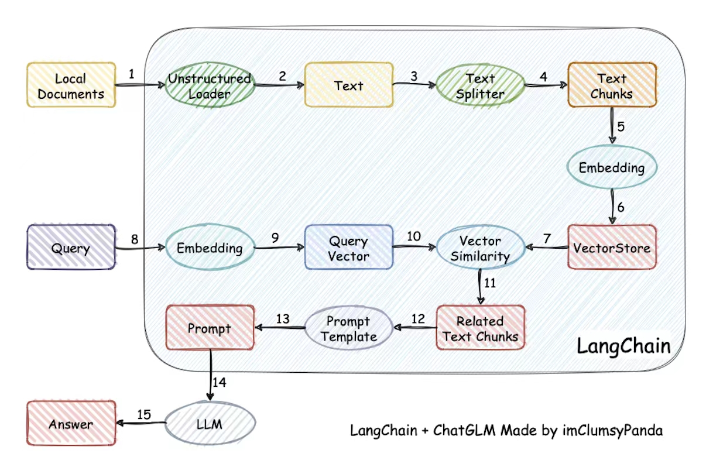
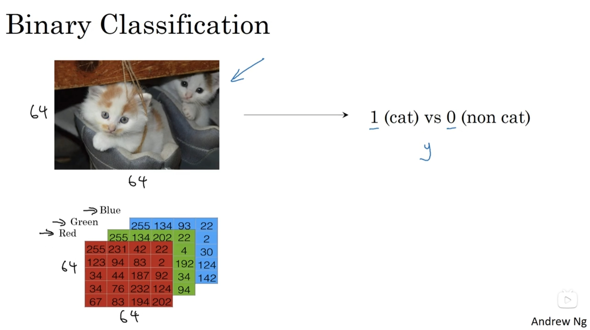
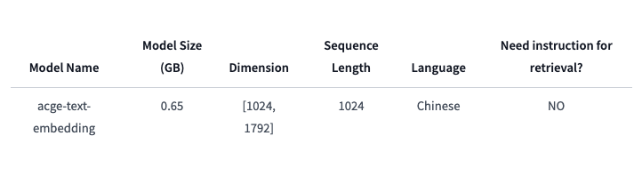
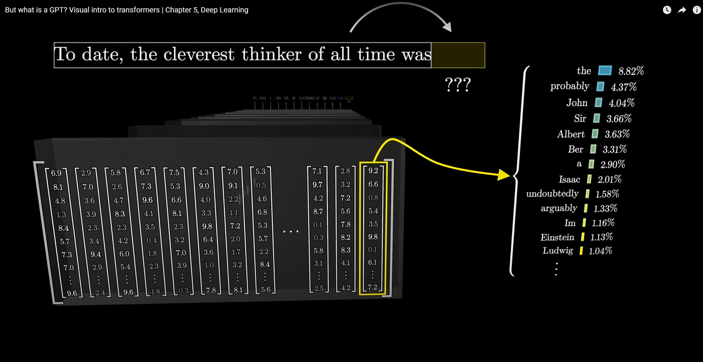
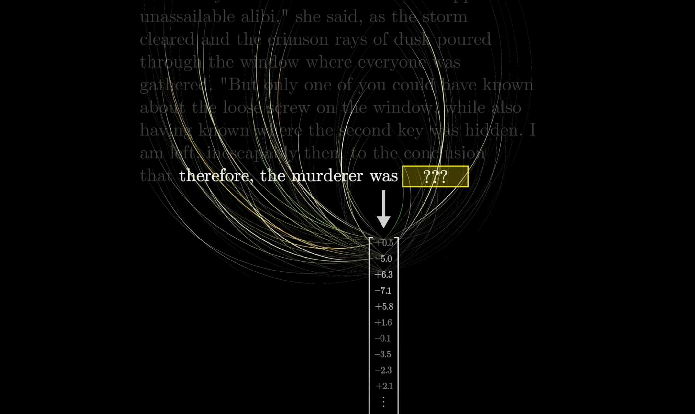
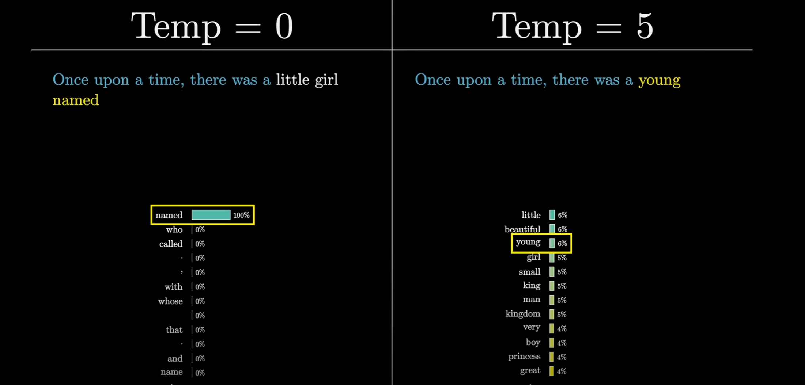
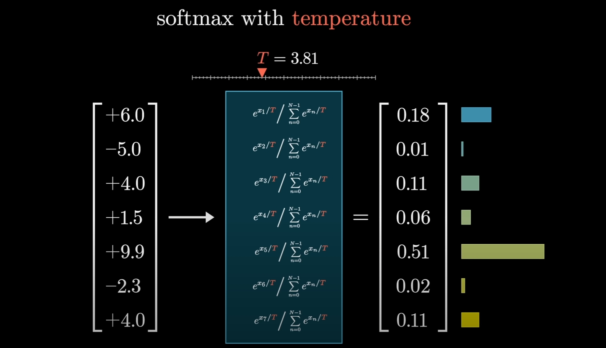
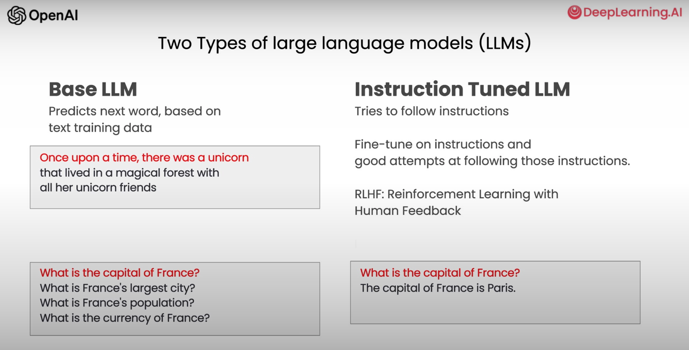

# RAG(Retrieval Augmented Generation)
## Why?
- latest data
- private data
- context window
- token price

Q: Is RAG still needed?

References:
- [Towards Long Context RAG](https://www.llamaindex.ai/blog/towards-long-context-rag)

### Application
- access private data
- crawl webpage
- invoke web API
- call customized function

## How?
### Traditional RAG Workflow

Major factors of traditional RAG workflow
- Retrieval (召回率)
- the ability of LLM (准确率)

#### Data Retrieval
Keyword search vs Semantic search(Natural Language Search)
e.g. 
Q: "有能聊 AI 的专家吗?"  
候选列表：
- "专家 1，能聊 AI",
- "专家 2，擅长 NLP，CV 领域",
- "专家 3，LLM 领域 10 年工作经验, 擅长写 prompt",
- "专家 4，35岁，前程序员，现任职饿了么",
- "专家 5，三甲医院医生",
- "专家 6，销售总监",

#### Embedding
##### Why?
measure text distance -> measure vector distance
- cosine distance
- inner product

Q: Can "embedding" understand antonym?
e.g. patient vs impatient

all fields of Machine learning generally ask us to transform information container into array of number.
e.g.
- sentence -> vector
- image -> pile of matrices
- video -> pile of images

##### Key parameters of Embedding

- dimension
- max/best sequence length(reason of document split)

References:
- [pgvector: Fewer dimensions are better](https://supabase.com/blog/fewer-dimensions-are-better-pgvector)
- [acge_text_embedding](https://huggingface.co/aspire/acge_text_embedding)

#### Rerank

Parameter: score_threshold

References:
- [Cross Encoder](https://www.sbert.net/examples/applications/cross-encoder/README.html#cross-encoders)
- [Cross-encoder re-ranking](https://learn.deeplearning.ai/courses/advanced-retrieval-for-ai/lesson/5/cross-encoder-re-ranking)

### Agentic RAG Workflow
- tool usage, function call
- [reAct](https://arxiv.org/abs/2210.03629) Agent

## LLM
LLM properties:
- stochastic
  
- sequential
  

References:
- [Visual intro to transformers](https://youtu.be/wjZofJX0v4M?si=Kx2H3Y5aAaxxK6_Q)

#### temperature parameter

#### Softmax with temperature

In practice, we often see softmax with temperature, which is a slight modification of softmax:

$$p_i = \frac{\exp(x_i/\tau)}{\sum_{j=1}^{N}\exp(x_j/\tau)}$$

The parameter $\tau$ is called the temperature parameter1, and it is used to control the softness of the probability distribution. When $\tau$ gets lower, the biggest value in $x$ get more probability, when $\tau$ gets larger, the probability will be split more evenly on different elements. Consider the extreme cases where $\tau$ approaches zero, the probability for the largest element will approach 1, while when $\tau$ approaches infinity, the probability for each element will be the same.

- [Softmax Temperature](https://github.com/sascha-kirch/ML_Notebooks/blob/main/Softmax_Temperature.ipynb)
### Base model vs Instruction Tuned Model

e.g. :  
- GPT3 vs Chat GPT(GPT3.5)
- Llama2 7B vs LLama2 7B chat
